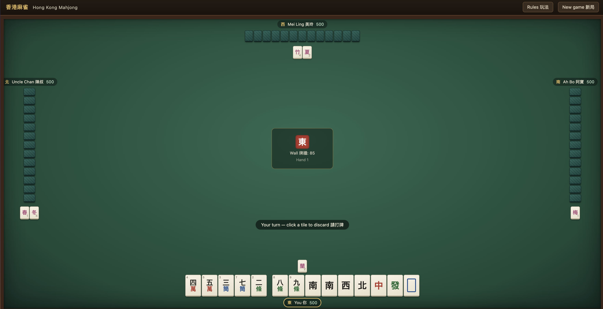

# Hong Kong Mahjong 香港麻雀

A complete Hong Kong style mahjong game in a single HTML file. You play against three AI opponents. No installation, no dependencies, no internet connection needed. Download the file, double-click it, and play in any modern browser.



## Quick start

```
git clone https://github.com/arifkyi/hk-mahjong.git
open hk-mahjong/HK-Mahjong.html
```

Or just download `HK-Mahjong.html` and open it directly. Everything (HTML, CSS, JavaScript) lives in that one file. Works offline on macOS, Windows, and Linux with Safari, Chrome, Firefox, or Edge.

## Features

- Full 144-tile set: characters 萬, dots 筒, bamboo 條, winds 東南西北, dragons 中發白, and 8 flower tiles with automatic reveal and replacement
- Standard Hong Kong winning hand: 4 melds and 1 pair, plus 十三么 (Thirteen Orphans) as a special hand
- All claim types: chow 上 (left player only), pung 碰, exposed/concealed/added kong 槓 with replacement draws from the wall tail
- Three AI opponents that evaluate their hands with a shanten calculator and only claim tiles when it actually improves their hand
- Real fan 番 scoring capped at 13 fan, with the classic doubling payout table
- Dealer rotation, prevailing wind 圈風 progression, and running scores across hands
- Bilingual interface (English and Traditional Chinese)

## Rules implemented

**Winning**: Complete 4 melds (chow, pung, or kong) plus a pair. Win off a discard (食糊) or by self-draw (自摸, worth 1 extra fan).

**Fan scoring** includes:

| Pattern | Fan |
|---|---|
| 平糊 All chows | 1 |
| 自摸 Self-draw | 1 |
| 門前清 Concealed hand | 1 |
| 正花 Seat flower / 無花 No flowers | 1 each |
| 門風 / 圈風 Seat or prevailing wind pung | 1 each |
| 中發白 Dragon pung | 1 each |
| 對對糊 All pungs | 3 |
| 混一色 Mixed one suit | 3 |
| 小三元 Small three dragons | 5 |
| 小四喜 Small four winds | 6 |
| 清一色 Pure one suit | 7 |
| 大三元 Big three dragons | 8 |
| 字一色 All honors | 10 |
| 十三么 / 大四喜 / 八仙過海 | 13 (limit) |

**Payouts**: 1 fan = 2 pts, 3 fan = 8, 5 fan = 24, 7 fan = 48, 10 fan = 128, 13 fan = 384. On a discard win the discarder (出銃) pays the winner. On self-draw all three opponents pay. Everyone starts with 500 points.

**Dealer**: The dealer stays after winning or after a drawn hand (流局). Otherwise the deal rotates, and the prevailing wind advances after each full round.

## How to play

1. A tile is drawn automatically on your turn. Click any tile in your hand to discard it.
2. When an opponent discards a tile you can use, action buttons appear: 上 Chow, 碰 Pung, 槓 Kong, 食糊 Win, or 過 Pass.
3. Concealed kong (暗槓) and added kong (加槓) buttons appear on your own turn when available.
4. Flowers are revealed and replaced for you automatically.
5. The Rules 玩法 button in the top bar has the full reference.

## Technical notes

- Single self-contained file, roughly 40 KB, zero external resources (no CDNs, no fonts, no images)
- Win detection uses full recursive hand decomposition into melds and a pair
- AI discard and claim decisions are driven by a standard shanten (tiles-from-ready) calculator
- Fan counting enumerates all valid decompositions of the winning hand and scores the highest interpretation
- Tile faces are rendered with CSS and CJK text, so no image assets are needed
- No localStorage or cookies. Scores persist for the session only

## Limitations

A few rules are intentionally simplified: no robbing the kong (搶槓), no minimum fan requirement (chicken hands 雞糊 are allowed), and the payout uses a flat shooter-pays model rather than regional half-payment variants. Pull requests welcome if you want to add your house rules.

## License

MIT. Do whatever you like with it, a mention is appreciated.

---

Built by [Rifky The Cyber](https://youtube.com/@RifkyTheCyber). If you enjoy the game, you can support my work on [Ko-fi](https://ko-fi.com/rifkythecyber).
